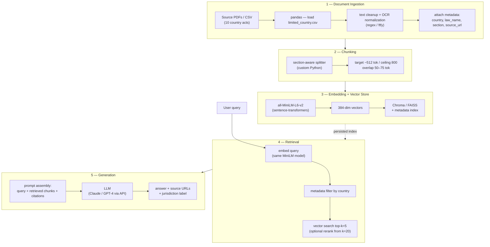

# Project 1 Planning: The Unofficial Guide

> Write this document before you write any pipeline code.
> Your spec and architecture diagram are what you'll use to direct AI tools (Claude, Copilot, etc.) to generate your implementation — the more specific they are, the more useful the generated code will be.
> Update the Retrieval Approach and Chunking Strategy sections if you change your approach during implementation.
> Update this file before starting any stretch features.

---

## Domain

### GRC Data Protection Policy Retrieval System

Overview

This project builds a Retrieval-Augmented Generation (RAG) pipeline for Governance, Risk, and Compliance (GRC) use cases, focusing on regulatory compliance, risk assessment, and data governance. The system allows querying global data protection laws and retrieving relevant legal frameworks efficiently.
Features

    

---

## Documents

<!-- List your specific sources: URLs, subreddit names, forum threads, or file descriptions.
     Aim for at least 10 sources that together cover different subtopics or perspectives within your domain. -->

| # | Source | Description | URL or location |
|---|--------|-------------|-----------------|
| 1 | Poland | Data Protection Law | https://uodo.gov.pl/en/file/754 |
| 2 | Lesotho | Data Protection Law | https://www.centralbank.org.ls/images/Legislation/Principal/Data_Protection_Act_2011.pdf |
| 3 | Zambia | Data Protection Law | https://www.parliament.gov.zm/sites/default/files/documents/acts/Act%20No.%203%20The%20Data%20Protection%20Act%202021_0.pdf |
| 4 | Iceland | Data Protection Law | https://www.dlapiperdataprotection.com/system/modules/za.co.heliosdesign.dla.lotw.data_protection/functions/handbook.pdf?country-1=IS |
| 5 | United States of America | Data Protection Law | https://www.energy.gov/sites/prod/files/cioprod/documents/ComputerFraud-AbuseAct.pdf |
| 6 | Kenya | Data Protection Act, 2019 (No. 24 of 2019) | https://www.kentrade.go.ke/wp-content/uploads/2022/09/Data-Protection-Act-1.pdf |
| 7 | Nigeria | Nigeria Data Protection Act, 2023 | https://cert.gov.ng/ngcert/resources/Nigeria_Data_Protection_Act_2023.pdf |
| 8 | Ghana | Data Protection Act, 2012 (Act 843) | https://ghalii.org/akn/gh/act/2012/843/eng@2012-05-18 |
| 9 | Uganda | Data Protection and Privacy Act, 2019 | https://ict.go.ug/wp-content/uploads/2019/03/Data-Protection-and-Privacy-Act-2019.pdf |
| 10 | Mauritius | Data Protection Act 2017 (Act No. 20 of 2017) | https://natlex.ilo.org/dyn/natlex2/natlex2/files/download/108724/MUS108724.pdf |

---

## Chunking Strategy

<!-- How will you split documents into chunks?
     State your chunk size (in tokens or characters), overlap size, and explain why those
     numbers fit the structure of your documents.
     A review-heavy corpus warrants different chunking than a long FAQ. -->

Since this is Statutory Legistlation Documents, preferred approach is Structure-aware (section-based) chuncking with a token cap and overlap feedback.

**Chunk size:**

Chunk size: ~512 tokens (target), 800 tokens (hard ceiling)

**Overlap:**

Overlap: 50–75 tokens (~10–15%)

**Reasoning:**

The core insight: GRC corpus is statutory legislation, not prose. Each law is already organized into discrete numbered sections, and your CSV rows already map closely to those sections. The chunking should respect that existing structure rather than impose arbitrary cuts.
Why section-based: Legal retrieval needs precision. A query about penalties needs the exact section, not a blurred window across unrelated clauses. Cutting mid-section would separate a fine from the offense it applies to, making the chunk legally meaningless.
The settings (~512 target / 800 ceiling / 50–75 overlap) follow from that:

512 tokens fits a typical statutory section
The 800 ceiling stops multiple sections bleeding into one chunk
Overlap only matters when a long section must be split, carrying the governing clause ("A person shall not process... unless—") into the continuation so conditions keep their anchor
A 256 minimum merges tiny fragments (definitions, gazette headers) so they don't add noise

---

## Retrieval Approach

<!-- Which embedding model are you using (e.g., all-MiniLM-L6-v2 via sentence-transformers)?
     How many chunks will you retrieve per query (top-k)?
     If you were deploying this for real users and cost wasn't a constraint, what tradeoffs
     would you weigh in choosing a different embedding model — context length, multilingual
     support, accuracy on domain-specific text, latency? -->

**Embedding model:**
all-MiniLM-L6-v2 via sentence-transformers. It's a strong default for this project: 384-dimensional embeddings, ~80MB, runs fast on CPU, and handles the ~512-token chunks from your chunking strategy comfortably. For a prototype indexing 10 statutes (a few hundred to a couple thousand chunks), it gives good semantic retrieval with near-zero infrastructure cost and sub-millisecond query encoding. Its 256-token input window is the one caveat — chunks longer than that get truncated, which is a real consideration given some statutory sections run long (see the tradeoff note below).

**Top-k:**
Retrieve k = 5 chunks per query. Legal questions usually hinge on one or two governing sections, but related provisions are often scattered (e.g., an offense in one section, its penalty in another, an exemption in a third). k=5 captures that spread without flooding the context with near-duplicate GDPR-derived text from other countries. Pair this with metadata filtering (filter by source (country) before the vector search when the query names a jurisdiction) so the 5 slots are spent on relevant law, not on Poland's text answering a Ghana question. If you add a reranker, retrieve a wider net first (k=20) and rerank down to the top 5.

**Production tradeoff reflection:**
If this were deployed for real users and cost weren't a constraint, I'd weigh four axes:
Context length. all-MiniLM-L6-v2's 256-token limit is the weakest point for legal text — long statutory sections get silently truncated, losing clauses that may be exactly what a query needs. A model with a 512–8k token window (e.g., bge-large-en-v1.5, e5-large-v2, or an API embedder like OpenAI text-embedding-3-large or Voyage's voyage-law-2) would embed full sections without cuts, directly improving recall.
Domain-specific accuracy. General-purpose MiniLM embeds legal language adequately but doesn't distinguish fine statutory nuance well. A larger or legal-tuned model (voyage-law-2 is explicitly trained on legal corpora) better separates concepts like "data controller" vs. "data processor" or "consent" vs. "legitimate interest" — distinctions that matter enormously when the corpus is full of similar GDPR-derived phrasing across ten countries. This is where a better model pays off most for your specific corpus.
Multilingual support. Your current sources are English, but several originate from non-English-speaking jurisdictions (Poland, Mauritius, Lesotho). If you ever ingest original-language versions or serve non-English queries, a multilingual model (paraphrase-multilingual-mpnet-base-v2, bge-m3, or multilingual-e5-large) becomes necessary — MiniLM would fail on cross-lingual retrieval.
Latency and operational cost. MiniLM wins decisively here: local, fast, free, no API dependency or data-egress concerns (relevant for legal/compliance contexts where sending text to third-party APIs may itself raise data-handling questions). Larger local models add GPU cost and latency; hosted API embedders add per-call cost, network latency, and a privacy consideration.

Net recommendation: for the prototype, MiniLM is the right call — cheap, fast, good enough to validate the pipeline
---

## Evaluation Plan

<!-- List your 5 test questions with their expected correct answers.
     Questions should be specific enough that you can judge whether the system's response
     is right or wrong. "What are good dining halls?" is too vague.
     "What do students say about wait times at [dining hall name] during lunch?" is testable. -->

| # | Question | Expected answer |
|---|----------|-----------------|
| 1 | Under Zambia's Data Protection Act 2021, within what timeframe must a data controller notify the Commissioner of a security breach? | Within 24 hours of any security breach affecting personal data processed (Section 49(1)). |
| 2 | Does Zambia's Act impose data localization, and is sensitive personal data treated differently? | Yes. Section 70 requires personal data to be stored on a server/data centre located in Zambia. The Minister may prescribe categories that can be stored outside the country (70(2)), but sensitive personal data must always be stored within Zambia (70(3)) — no exception. |
| 3 | What age defines a "child" under Lesotho's Data Protection Act 2011, and how does that compare to Zambia's approach? | Lesotho defines a child as a natural person under the age of 18 years (fixed numeric definition). Zambia does not set a number — it assigns "child" the meaning given in its Constitution. |
| 4 | How do data subject rights to erasure and data portability differ between Kenya's 2019 Act and Mauritius' 2017 Act? | Both grant erasure, rectification, and objection rights. Kenya (Act No. 24 of 2019) frames rights around its Constitution (Art. 31) and provides erasure/deletion and correction. Mauritius (Act No. 20 of 2017) provides access, rectification, erasure, and restriction rights closely tracking the GDPR. Key difference: Kenya is more recent and constitutionally anchored; Mauritius is GDPR-aligned from 2017. |
| 5 | Which of these ten laws establishes a dedicated enforcement authority, and what is Zambia's called specifically? | All ten establish an oversight body. Zambia's is the Office of the Data Protection Commissioner, established under the Ministry responsible for communications (Section 4), headed by a Data Protection Commissioner appointed by the President. |

---

## Anticipated Challenges

<!-- What could go wrong? Name at least two specific risks with reasoning.
     Consider: noisy or inconsistent documents, missing source attribution, off-topic
     retrieval, chunks that split key information across boundaries. -->

anticipated challenges for your data protection law RAG system, each with concrete reasoning grounded in what your corpus actually looks like.
Anticipated Challenges
1. Cross-jurisdiction contamination from near-identical GDPR-derived text.
This is the single biggest risk for this corpus. Many of your ten laws (Poland, Mauritius, Kenya, Nigeria, the European entries) are deliberately modeled on the EU GDPR, so they share large amounts of nearly identical phrasing — the same definitions of "personal data," "data controller," "consent," and the same enumerated data subject rights. Because embeddings capture semantic meaning, a query like "what are the breach notification requirements?" will pull back chunks from five different countries that all say almost the same thing, and the system may answer with the wrong country's specific timeframe or penalty. A user asking about Ghana could receive Poland's clause. Mitigation: enforce metadata filtering by country before the vector search whenever the query names a jurisdiction, and always surface the source country in the answer so wrong-jurisdiction errors are visible rather than silent.
2. Key information split across chunk boundaries (offense ↔ penalty ↔ exemption).
Statutes routinely separate an offense, its penalty, and any exemptions into different numbered sections. Your own data shows this — in Zambia the breach-notification duty is in Section 49, the penalty regime in Sections 73 and 77, and exemptions in Part VII. If chunking puts these in separate chunks and top-k only retrieves one, the system can confidently state a rule while omitting the penalty or the exemption that completely changes the answer. Mitigation: retrieve a wider net (k=15–20) and rerank, attach section_number and part metadata so related provisions can be linked, and consider a retrieval step that pulls adjacent sections of the same act when a section is matched.
A couple more worth listing if the template allows expansion:
3. OCR noise and inconsistent source quality. Several documents in your dataset were clearly OCR-extracted from scanned PDFs — the Lesotho rows contain garbled text like "natural person under the age of 1b yeus" (should read "18 years") and "codeofconduct" run together without spaces. This corrupts both embeddings (the model sees nonsense tokens) and any answer that quotes the text directly. A query about Lesotho's child age could retrieve the right chunk but surface unreadable text, or miss it entirely because "1b yeus" doesn't embed near "18 years." Mitigation: run a cleanup/normalization pass before chunking, flag low-quality sources, and prefer cleaner authoritative versions where available.
4. Missing or unreliable source attribution. Your sources are a mix of official government sites and third-party aggregators (e.g., DLA Piper, ILO NATLEX). If the system can't reliably tie each chunk back to its exact source_url and section, legal answers become unciteable — and in a legal/compliance context, an answer without a verifiable source is close to useless and potentially harmful if relied upon. Mitigation: make source_url a mandatory chunk-level field, never drop it during processing, and have the system refuse to answer (or flag uncertainty) when retrieved chunks lack clean attribution

---

## Architecture

<!-- Draw a diagram of your pipeline showing the five stages:
     Document Ingestion → Chunking → Embedding + Vector Store → Retrieval → Generation
     Label each stage with the tool or library you're using.
     You can use ASCII art, a Mermaid diagram, or embed a sketch as an image.
     You'll use this diagram as context when prompting AI tools to implement each stage. -->

Here's the architecture for your data protection law RAG pipeline, showing all five stages with the specific tools at each. I'll give you a Mermaid diagram (renders in most Markdown viewers) plus an ASCII fallback and per-stage notes you can paste directly into an AI tool when implementing each stage.

## Architecture



### ASCII fallback

```
┌──────────────────────────────────────────────────────────────────────┐
│ 1. DOCUMENT INGESTION                                                   │
│    Source PDFs / limited_country.csv  →  pandas (load CSV)              │
│    →  text cleanup + OCR normalization (regex / ftfy)                   │
│    →  attach metadata {country, law_name, section, source_url}          │
└───────────────────────────────┬──────────────────────────────────────┘
                                 ▼
┌──────────────────────────────────────────────────────────────────────┐
│ 2. CHUNKING                                                            │
│    section-aware splitter (custom Python)                               │
│    target ~512 tok / ceiling 800 / overlap 50–75 tok                   │
│    rule: one section = one chunk; split oversize on subsections        │
└───────────────────────────────┬──────────────────────────────────────┘
                                 ▼
┌──────────────────────────────────────────────────────────────────────┐
│ 3. EMBEDDING + VECTOR STORE                                           │
│    all-MiniLM-L6-v2 (sentence-transformers) → 384-dim vectors          │
│    →  Chroma or FAISS  +  metadata index (persisted to disk)          │
└───────────────────────────────┬──────────────────────────────────────┘
                                 ▼  (persisted index)
┌──────────────────────────────────────────────────────────────────────┐
│ 4. RETRIEVAL                              ◄── User query                │
│    embed query (same MiniLM)                                           │
│    →  metadata filter by country (if named)                            │
│    →  vector search top-k=5  (optional: retrieve k=20 → rerank → 5)    │
└───────────────────────────────┬──────────────────────────────────────┘
                                 ▼
┌──────────────────────────────────────────────────────────────────────┐
│ 5. GENERATION                                                         │
│    prompt assembly: query + retrieved chunks + citation instructions   │
│    →  LLM (Claude / GPT-4 via API)                                     │
│    →  answer WITH source URLs + jurisdiction label                     │
└──────────────────────────────────────────────────────────────────────┘
```

### Stage-by-stage tool summary

| Stage | Tool / Library | Key responsibility |
|---|---|---|
| 1. Ingestion | pandas, ftfy/regex (+ pdfplumber if re-ingesting raw PDFs) | Load CSV, clean OCR noise, tag every record with country + source_url metadata |
| 2. Chunking | Custom Python splitter (tiktoken for token counts) | Section-aware splitting, ~512 target / 800 ceiling / 50–75 overlap |
| 3. Embedding + Store | sentence-transformers (`all-MiniLM-L6-v2`), Chroma or FAISS | Encode chunks to 384-dim vectors; persist with metadata for filtering |
| 4. Retrieval | Chroma/FAISS query API (+ optional cross-encoder reranker) | Embed query, filter by jurisdiction, return top-k=5 |
| 5. Generation | LLM API (Claude or GPT-4) | Synthesize grounded answer, enforce citations and jurisdiction labeling |

### Two design choices worth flagging when you implement

The dotted line between stages 3 and 4 marks where the pipeline splits into **offline (build-time)** and **online (query-time)**. Stages 1–3 run once to build the persisted index; stages 4–5 run on every user query. Keep these as separate scripts/modules — it's a common mistake to re-embed the whole corpus on each query.

The **metadata filter in stage 4** and the **jurisdiction label in stage 5** are not optional extras for this corpus — they're the direct defense against the cross-jurisdiction contamination risk from your challenges section, where GDPR-derived text from ten countries looks nearly identical to the embedding model.

When you prompt an AI tool to implement a stage, paste that stage's row from the table plus the relevant constraints (e.g., for stage 2: "section-aware, ~512 target tokens, 800 ceiling, 50–75 overlap, one section per chunk, preserve country/section/source_url metadata"). Want me to generate the actual implementation code for any specific stage?

---

## AI Tool Plan

<!-- For each part of the pipeline below, describe:
     - Which AI tool you plan to use (Claude, Copilot, ChatGPT, etc.)
     - What you'll give it as input (which sections of this planning.md, which requirements)
     - What you expect it to produce
     - How you'll verify the output matches your spec

     "I'll use AI to help me code" is not a plan.
     "I'll give Claude my Chunking Strategy section and ask it to implement chunk_text()
     with my specified chunk size and overlap" is a plan. -->
Stage 1 — Document Ingestion + OCR cleanup
I'll use Claude (in this chat interface, with the CSV uploaded) because it can read the file directly and I've already used it to confirm the OCR corruption (e.g., Lesotho's "1b yeus" for "18 years"). Input: my Anticipated Challenges section (specifically challenge 3 on OCR noise) plus the limited_country.csv file, with the instruction to write a load_and_clean() function using pandas and ftfy/regex that loads the CSV, normalizes OCR artifacts, and attaches {country, law_name, section, source_url} metadata to each record. Expected output: a Python function returning a list of cleaned records with metadata. Verification: run it on the actual CSV and spot-check 5 known-bad rows (the Lesotho child-age row, the gazette header rows) to confirm "1b yeus" → "18 years" and that source_url is populated for every record; assert zero rows have empty metadata fields.
Stage 2 — Chunking
I'll use Claude, giving it my Chunking Strategy section verbatim (the section-aware rules, ~512 target / 800 ceiling / 256 minimum / 50–75 overlap, and the section→subsection→sliding-window split priority). Input: that section plus a sample of cleaned records from stage 1. Expected output: a chunk_text() function using tiktoken for token counting that implements one-section-per-chunk, splits oversized sections on subsection boundaries, merges fragments under 256 tokens, and preserves metadata on every chunk. Verification: run on the full corpus and assert no chunk exceeds 800 tokens, no chunk (except final fragments) falls below 256, every chunk carries its section_number and source_url, and manually inspect that Zambia Section 49 lands in a single chunk rather than being split mid-clause.
Stage 3 — Embedding + Vector Store
I'll use GitHub Copilot for the boilerplate (it's faster for well-known library setup) and fall back to Claude if the sentence-transformers/Chroma wiring needs debugging. Input: my Retrieval Approach section (which specifies all-MiniLM-L6-v2, 384 dims) and the Architecture diagram's stage 3 row. Expected output: an embed_and_store() function that encodes chunks with MiniLM and persists them to Chroma (or FAISS) with metadata indexed for filtering. Verification: confirm the index contains the expected chunk count, embeddings are 384-dimensional, a test query returns results, and metadata filtering by country actually narrows results (query with country="Zambia" should return only Zambia chunks).
Stage 4 — Retrieval
I'll use Claude, giving it my Retrieval Approach section (top-k=5, metadata filter by jurisdiction, optional rerank from k=20) and Anticipated Challenges section (challenge 1 on cross-jurisdiction contamination, since the filter is the defense against it). Input: those two sections plus the stage 3 vector store interface. Expected output: a retrieve() function that detects a named country in the query, applies the metadata filter, runs vector search, and returns the top 5 chunks with scores and source URLs. Verification: run my 5 test questions through it and confirm question 1 (Zambia breach) retrieves the Section 49 chunk in the top 5, and that a Ghana-specific query returns zero Poland/Mauritius chunks — directly testing the contamination defense.
Stage 5 — Generation
I'll use Claude (also the runtime LLM for generation), giving it my 5 Test Questions table with expected answers and the Architecture stage 5 requirements (answer must include source URLs and a jurisdiction label). Input: those, plus a prompt template that injects retrieved chunks and citation instructions. Expected output: a generate_answer() function that assembles the prompt, calls the LLM, and returns a grounded answer with citations and the country label. Verification: this is where my 5 test questions become the acceptance test — run all five end-to-end and grade each response against its expected answer (24 hours for Q1, the two-part localization rule for Q2, "18 / Constitution" for Q3, etc.). A passing system gets at least 4 of 5 correct with correct source attribution; any answer that omits the jurisdiction or cites the wrong country fails regardless of factual content.
Cross-cutting verification principle
The thread tying this together: my 5 Test Questions section is the master acceptance test for the whole pipeline, and stages 2–4 each have a narrower structural check (token bounds, dimension count, jurisdiction filtering) that catches problems before they reach end-to-end evaluation. I'll keep the AI-generated code and my verification asserts in separate files so the tests stay honest — I won't ask the same tool to both write the chunker and certify that it passed.

**Milestone 3 — Ingestion and chunking:**
- *Tool:* Claude Code (in the IDE, with direct access to the repo and CSV).
- *Input:* my Chunking Strategy section plus the actual `country_plus_policies.csv` (218 rows;
  columns `Subject, Date, Body, filepath, Source`).
- *What it produced:* the ingestion logic in `Embedding_Setup.py` — a `pandas` load of the CSV
  and a `chunk_text()` function that normalizes whitespace and splits each policy's `Body` into
  ~450-character, sentence-boundary-aware chunks with 75-char overlap. Each chunk is stored with
  its row metadata (`Subject, Date, Source, filepath`) plus `row` and `chunk` index for
  traceability.
- *What I changed/overrode:* I had originally specified token-based, section-aware chunking
  (~512 target). During implementation we discovered the embedding model truncates at **128
  tokens**, so I switched to a smaller 450-char window to guarantee the full text is embedded
  rather than silently cut off (see Spec divergence note).
- *Verification:* re-ran ingestion and confirmed 218 policies expand to **2,000 chunks**, and
  spot-checked that retrieval now returns substantive policy text instead of table-of-contents
  fragments.

**Milestone 4 — Embedding and retrieval:**
- *Tool:* Claude Code for the sentence-transformers / Chroma wiring and debugging.
- *Input:* my Retrieval Approach section plus the chunked records from Milestone 3.
- *What it produced:* embedding + storage in `Embedding_Setup.py` (model `all-MiniLM-L12-v2` →
  384-dim vectors, persisted to a Chroma `PersistentClient` at `./chroma_db` with
  `hnsw:space: cosine`), and the `retrieve()` function in `rag_query.py` that embeds the query,
  runs `collection.query(...)` with distances, converts cosine distance to a similarity score,
  and filters out chunks below a `MIN_SIMILARITY` threshold (0.15).
- *What I changed/overrode:* I used `all-MiniLM-L12-v2` (not L6 as originally planned), set
  top-k to **3** instead of 5, and have not yet implemented the planned country metadata filter.
- *Verification:* confirmed the index holds 2,000 384-dim vectors, and the query "What is
  Iceland's Data Privacy Policy?" returns Iceland chunks at the top with similarity ~0.72.

**Milestone 5 — Generation and interface:**
- *Tool:* Claude Code for code; Groq-hosted `llama-3.3-70b-versatile` as the runtime LLM.
- *Input:* the project's grounding requirement (answer only from retrieved context, cite
  sources) and the recommended Gradio interface pattern.
- *What it produced:* the generation layer in `rag_query.py` — a grounding system prompt that
  forbids outside knowledge, defines a fixed refusal string when context is insufficient, and
  requires citations by country + bracket number — wrapped in an `ask()` function returning
  `{"answer", "sources"}`; plus `app.py`, a Gradio web UI (question box, Ask button,
  Enter-to-submit, separate Answer / Retrieved-from panes, and clickable example questions).
- *What I changed/overrode:* generation uses Groq (`llama-3.3-70b-versatile`) at low
  temperature (0.2) for grounded output, rather than the Claude/GPT-4 placeholder in the plan.
- *Verification:* ran the pipeline end-to-end through both `rag_query.py` and the Gradio
  `handle_query()`; confirmed grounded, cited answers and that the server serves on
  http://localhost:7860 (HTTP 200).
